# Введение в программную инженерию. Фаза 2

Проект: Mental Diary

Команда:
- Викторов Всеволод, менеджер
- Дюбов Максим
- Федорищев Михаил
- Кузин Илья
- Прокопьев Даниил

## 1. Актуализировать правила работы в команде

1.1. Базовые правила первой фазы сохраняются без изменений.

1.2. Еженедельная синхронизация продолжается по воскресеньям в 16:00.

1.3. Для ежедневной оперативной коммуникации используется Telegram-чат.

1.4. Еженедельный отчет о прогрессе передается менеджеру не позднее субботы.

1.5. При возникновении блокеров участник сообщает о проблеме в день обнаружения, чтобы менеджер мог перераспределить задачи.

1.6. Для фазы 2 вводится дополнительное правило: все архитектурные решения и уточнения требований фиксируются в одном общем документе, чтобы не терялась связь между анализом, проектированием и будущей реализацией.

## 2. Актуализировать план проекта

2.1. Сроки фазы 2: 09.03.2026–28.03.2026.

2.2. Цель фазы 2: перейти от аналитической модели к проектной, зафиксировать архитектуру, подготовить детальные сценарии приоритетных вариантов использования и определить основу для реализации в фазе 3.

2.3. Роли на фазе 2:

| Участник | Основная зона ответственности |
| --- | --- |
| Викторов Всеволод | координация, контроль артефактов, финальная сборка отчета |
| Дюбов Максим | проектирование backend-модулей, API, хранение данных |
| Федорищев Михаил | AI-логика, рекомендации, интеграции с внешними сервисами |
| Кузин Илья | frontend-прототипы, пользовательские сценарии, GUI |
| Прокопьев Даниил | диаграммы, документирование, тест-кейсы, сверка требований |

2.4. Результат фазы 2: набор архитектурных и проектных артефактов, достаточный для перехода к реализации и бета-сборке в фазе 3.

## 3. Распределить ресурсы проекта

3.1. Человеческий ресурс остается тем же, что и в фазе 1: 5 человек.

3.2. Плановая нагрузка на фазу 2:

| Участник | План часов | Основной фокус |
| --- | --- | --- |
| Викторов Всеволод | 12 | координация и интеграция результатов |
| Дюбов Максим | 10 | backend, API, модель хранения |
| Федорищев Михаил | 10 | AI-модуль, рекомендации, внешние сервисы |
| Кузин Илья | 10 | GUI-прототипы, пользовательские сценарии |
| Прокопьев Даниил | 8 | документация, диаграммы, тестовая модель |

3.3. Технические ресурсы: VS Code, GitHub, Figma, Telegram, облачное хранилище для промежуточных файлов, инструменты генерации диаграмм Mermaid.

## 4. Определить план для итераций фазы

4.1. Фаза 2 делится на две итерации.

4.2. Итерация 2.1: уточнение модели анализа, детализация приоритетных вариантов использования, предварительная архитектура и черновые диаграммы.

4.3. Итерация 2.2: спецификация архитектуры, описание интерфейсов подсистем, прототип GUI, тестовая схема и итоговый отчет изменений фазы.

4.4. Приоритет выполнения задач в фазе 2:

| Приоритет | Задачи |
| --- | --- |
| Высокий | детализация VIs, архитектура, риск-реестр, способы реализации NFR |
| Средний | прототипирование GUI, тест-кейсы, последовательность сборок |
| Низкий | косметические улучшения и второстепенные экраны |

## 5. Выполнить переход от модели анализа ВИ к модели проектирования

5.1. В фазе 1 проект был описан на уровне предметной области, требований и общего набора вариантов использования.

5.2. В фазе 2 проект переводится на проектный уровень: появляются подсистемы, интерфейсы, классы проектирования, соглашения о данных и способах обмена сообщениями.

5.3. Главный принцип перехода: каждый приоритетный вариант использования должен получить понятный сценарий, набор участвующих классов и место в архитектуре.

5.4. Сценарии реализации в фазе 2 охватывают около 40–80 процентов функционального ядра системы, чтобы в фазе 3 можно было собрать рабочий прототип без пересмотра концепции.

## 6. Уточнить глоссарий

6.1. Mental Diary — веб-система для мониторинга психоэмоционального состояния и поддержки пользователя.

6.2. Запись дневника — ежедневный набор ответов пользователя о самочувствии, событиях и эмоциях.

6.3. Анализ тенденций — обработка исторических данных для поиска устойчивых изменений в состоянии.

6.4. Рекомендация — совет, сформированный системой на основе анализа данных пользователя.

6.5. Критическая тенденция — совокупность признаков, при которой система рекомендует специалиста.

6.6. Адаптер AI — слой интеграции с внешним сервисом генерации текста или анализа.

6.7. Fallback — запасной сценарий работы при недоступности AI-сервиса.

6.8. Подсистема — логически выделенная часть системы с собственными обязанностями и интерфейсом.

6.9. Билд — собранная версия проекта, пригодная для проверки и демонстрации.

## 7. Уточнить список акторов

7.1. Пользователь — основной актор, который ведет дневник, смотрит аналитику и получает рекомендации.

7.2. Специалист — актор, участвующий в подборе консультаций и верификации критических рекомендаций.

7.3. Администратор — актор, управляющий контентом, пользователями и справочными данными.

7.4. AI-сервис — внешний актор, используемый для анализа текста и генерации рекомендаций.

7.5. Сервис подбора специалистов — внешний актор, который возвращает список подходящих специалистов по критериям.

7.6. Сервис уведомлений — внешний актор, через который система может отправлять напоминания и предупреждения.

## 8. Уточнить архитектурно значимые ВИ

8.1. ВИ1 «Ввод ежедневной записи» остается базовым сценарием и необходим для накопления данных.

8.2. ВИ2 «Просмотр аналитики» является архитектурно значимым, потому что определяет модель обработки данных и визуализацию результатов.

8.3. ВИ3 «Получение рекомендаций» является архитектурно значимым, потому что требует AI-интеграции и fallback-логики.

8.4. ВИ4 «Подбор специалиста» является архитектурно значимым, потому что зависит от внешнего источника данных и правил отбора.

8.5. ВИ5 «Участие в форуме» и ВИ6 «Чтение блога» оставляются в проекте, но не входят в критическое ядро фазы 2.

## 9. Актуализировать список ВИ по приоритетам

9.1. Высокий приоритет: ВИ1, ВИ2, ВИ3, ВИ4.

9.2. Средний приоритет: ВИ5.

9.3. Низкий приоритет: ВИ6.

9.4. Для архитектуры фазы 2 выбираются сценарии ВИ1–ВИ4, поскольку именно они создают основу продукта.

## 10. Детализировать ВИ в порядке приоритетов

10.1. ВИ1 «Ввод ежедневной записи».

10.1.1. Актор: Пользователь.

10.1.2. Предусловия: пользователь зарегистрирован и авторизован.

10.1.3. Основной сценарий: пользователь открывает экран дневника, система показывает форму, пользователь вводит настроение, события и эмоции, система проверяет данные, сохраняет запись и подтверждает успех.

10.1.4. Альтернативы: некорректные данные; отсутствует соединение с сервером; локальное временное сохранение.

10.1.5. Постусловие: запись доступна для анализа.

10.2. ВИ2 «Просмотр аналитики».

10.2.1. Актор: Пользователь.

10.2.2. Предусловия: в системе есть несколько записей пользователя.

10.2.3. Основной сценарий: пользователь открывает аналитику, система собирает записи, строит тренды, визуализирует изменения и формирует отчет.

10.2.4. Альтернативы: недостаточно данных; пользователь получает сообщение о необходимости добавить записи.

10.2.5. Постусловие: пользователь видит динамику состояния.

10.3. ВИ3 «Получение рекомендаций».

10.3.1. Актор: Пользователь, AI-сервис.

10.3.2. Основной сценарий: система передает данные в AI-модуль, получает текстовые советы, фильтрует их и показывает пользователю.

10.3.3. Альтернативы: AI недоступен; система включает fallback и показывает упрощенные рекомендации на основе статистики.

10.4. ВИ4 «Подбор специалиста».

10.4.1. Актор: Пользователь, сервис подбора специалистов.

10.4.2. Основной сценарий: система определяет критический профиль, запрашивает список специалистов, ранжирует его и показывает пользователю.

10.4.3. Альтернативы: внешний сервис недоступен; система предлагает список из локального справочника.

## 11. Анализировать ВИ

11.1. На этапе анализа зафиксированы основные классы предметной области: User, Entry, MoodState, Analysis, Recommendation, Specialist, ForumPost, Article.

11.2. Для фазы 2 важнее всего связи между User, Entry, Analysis и Recommendation, потому что именно они поддерживают главный пользовательский сценарий.

11.3. Дополнительные классы для внешних сервисов оформляются как адаптеры и интерфейсы, а не как часть предметной области.

### Диаграмма 1. Модель анализа вариантов использования

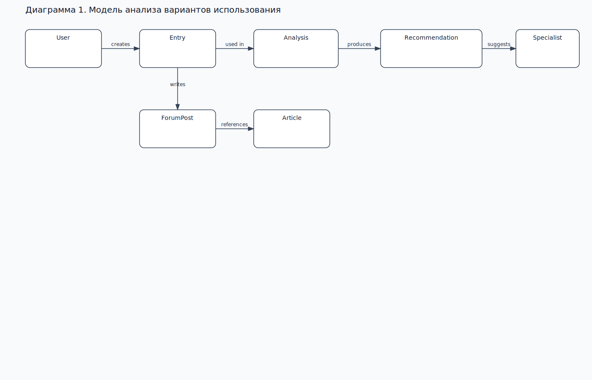

Mermaid source

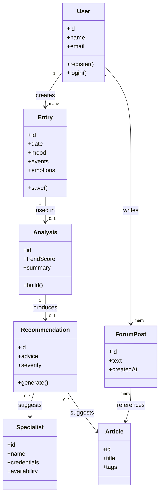

## 12. Распределить обязанности по классам анализа

12.1. User отвечает за идентификацию и хранение базового профиля пользователя.

12.2. Entry хранит ежедневные факты и обеспечивает исходный материал для анализа.

12.3. Analysis агрегирует записи и вычисляет тенденции.

12.4. Recommendation интерпретирует результаты анализа и формирует поддержку.

12.5. Specialist хранит профиль внешнего специалиста и доступность для консультаций.

12.6. ForumPost и Article поддерживают вторичные функции общения и контента, но не являются ядром фазы 2.

## 13. Детализировать модель ВИ

13.1. В фазе 2 модель ВИ фиксируется не только в виде общего описания, но и через текстовые сценарии и проектные диаграммы.

13.2. Для модели используются: диаграмма вариантов использования, sequence diagram для записи и анализа, activity diagram для цепочки рекомендаций, component diagram для архитектуры.

### Диаграмма 2. Варианты использования

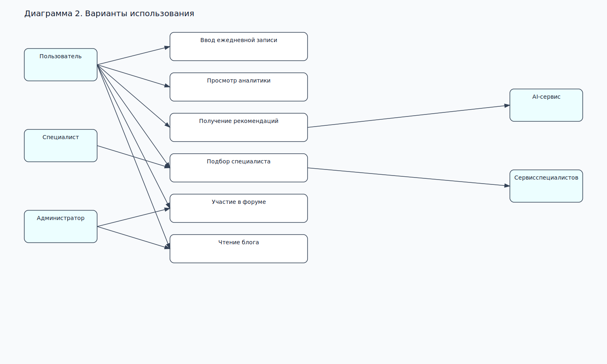

Mermaid source

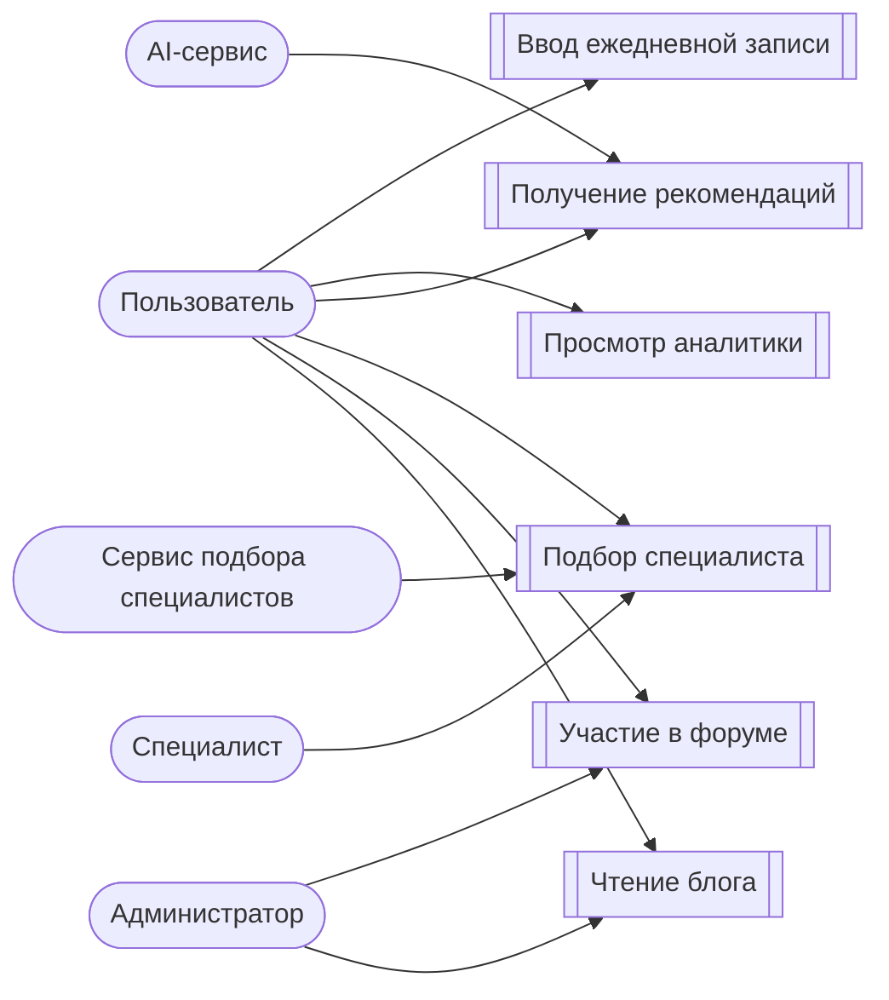

## 14. Разрешить архитектурные риски

14.1. Риск AI-интеграции закрывается через адаптер, mock-режим и fallback на rule-based аналитику.

14.2. Риск роста базы данных закрывается раздельным хранением профильных данных и временных рядов, а также индексами по дате и пользователю.

14.3. Риск потери доступности внешнего сервиса закрывается кешированием результатов и повторными запросами с ограничением по времени.

14.4. Риск разрыва между фронтендом и backend закрывается контрактами API и ручной синхронизацией схем.

14.5. Риск неоднозначной аналитики закрывается формализацией метрик состояния и проверкой на коротких сценариях.

## 15. Актуализировать список рисков проекта

15.1. Архитектурный риск: недоступность AI-сервиса.

15.2. Архитектурный риск: рост объема данных и усложнение запросов.

15.3. Аналитический риск: недостаточная формализация эмоциональных признаков.

15.4. Аналитический риск: изменение требований к рекомендациям после демонстрации заказчику.

15.5. Организационный риск: задержка согласования диаграмм и макетов.

15.6. Технический риск: расхождение между прототипом и будущей реализацией.

## 16. Определить способ реализации нефункциональных требований

16.1. Производительность: кеширование аналитики, асинхронная обработка AI-запросов, индексирование базы.

16.2. Надежность: резервное сохранение, повторные попытки отправки запросов, fallback-режим.

16.3. Безопасность: HTTPS, JWT, разделение ролей, минимизация хранимых чувствительных данных.

16.4. Масштабируемость: компонентная архитектура и горизонтальное масштабирование backend.

16.5. Удобство: мобильная адаптивность, короткие сценарии ввода, понятные графики.

16.6. Доступность: ясная терминология, поддержка темной и светлой темы на уровне прототипа.

## 17. Определить способ реализации бизнес-логики

17.1. Бизнес-логика делится на четыре ядра: прием записи, анализ данных, генерация рекомендаций, подбор специалистов.

17.2. Правила анализа оформляются в отдельном сервисе или модуле domain/services.

17.3. Любая рекомендация должна опираться либо на AI, либо на статистический fallback, чтобы система не оставалась без ответа.

17.4. Критические условия должны запускать отдельную ветку сценария: усиленная рекомендация и предложение специалиста.

## 18. Определить способ реализации уровня хранения данных

18.1. Основное хранилище: PostgreSQL.

18.2. Временные ряды и история настроения: отдельная таблица или TimescaleDB-совместимый слой.

18.3. Для фазы 2 фиксируется логическая модель данных, а физическая схема будет уточняться в фазе 3.

18.4. Основные сущности хранения: users, entries, analyses, recommendations, specialists, forum_posts, articles.

## 19. Определить способ реализации взаимодействия с пользователем

19.1. Пользовательский интерфейс строится как веб-приложение с понятными экранами: главная, дневник, аналитика, рекомендации, форум, блог.

19.2. Взаимодействие строится вокруг коротких карточек ввода, чтобы ежедневная запись занимала минимум времени.

19.3. Для фаз 2 и 3 подготавливаются прототипы экранов и навигационный поток между ними.

### Диаграмма 3. Поток работы пользователя

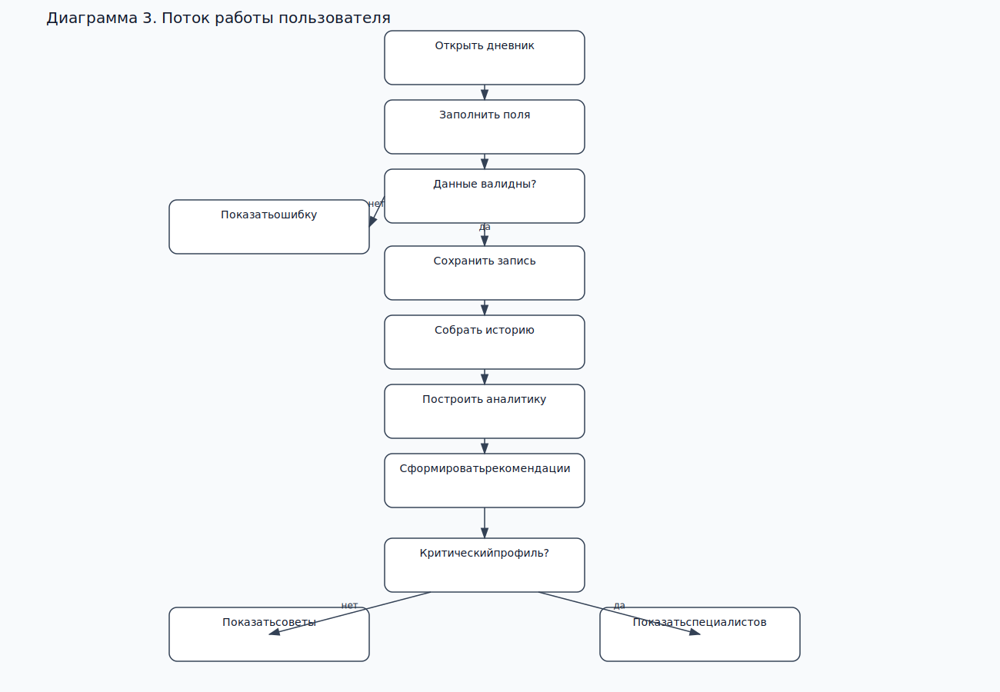

Mermaid source

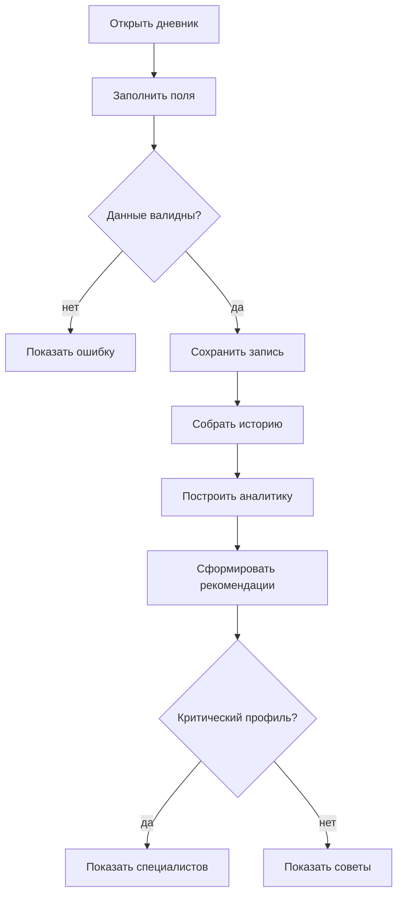

## 20. Определить способ реализации взаимодействия с внешними системами

20.1. AI-интеграция оформляется через отдельный адаптер, чтобы смена провайдера не ломала основную логику.

20.2. Сервис специалистов также подключается через интерфейс, а не напрямую из UI.

20.3. При недоступности любого внешнего сервиса система должна возвращать локальный ответ без ошибки сценария.

## 21. Зафиксировать стек технологий разработки

21.1. Frontend: React, TypeScript, UI-библиотека по выбору команды.

21.2. Backend: Node.js, Express или NestJS.

21.3. Data layer: PostgreSQL, при необходимости TimescaleDB-совместимое расширение.

21.4. AI integration: Hugging Face API или OpenAI API, через собственный адаптер.

21.5. Testing: Jest и базовые сценарные тесты.

21.6. Build and deployment: GitHub Actions, Docker, Docker Compose.

## 22. Анализировать текущее состояние архитектуры

22.1. В фазе 2 архитектура переводится из концептуального вида в вид, пригодный для проектирования и последующей реализации.

22.2. Система разбивается на следующие подсистемы: presentation, application, domain, infrastructure.

22.3. Ключевой принцип: аналитическая модель должна быть прослеживаема до подсистем и интерфейсов.

### Диаграмма 4. Архитектура системы

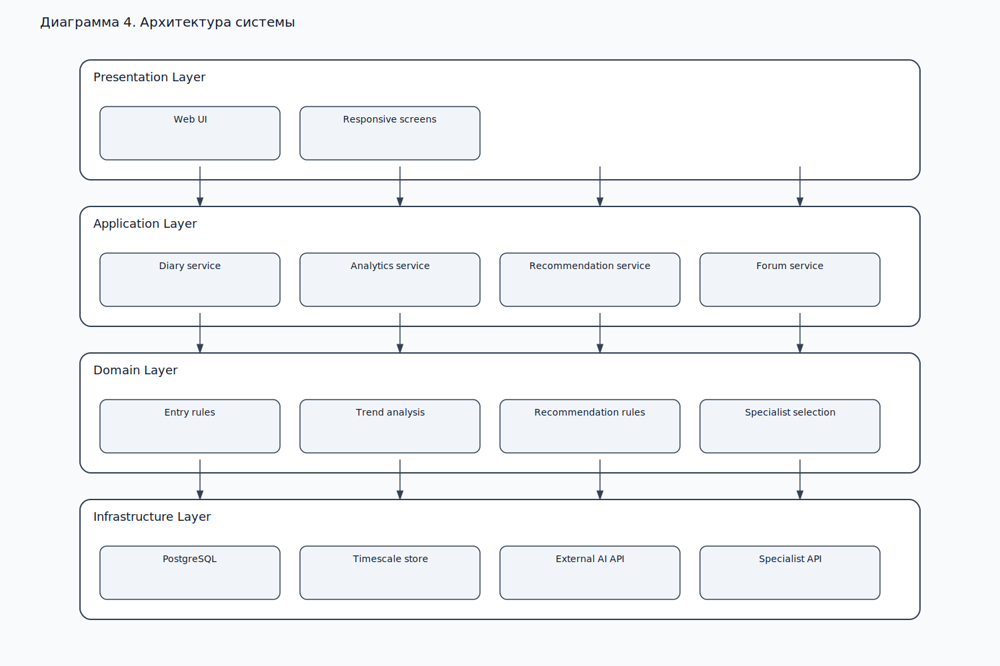

Mermaid source

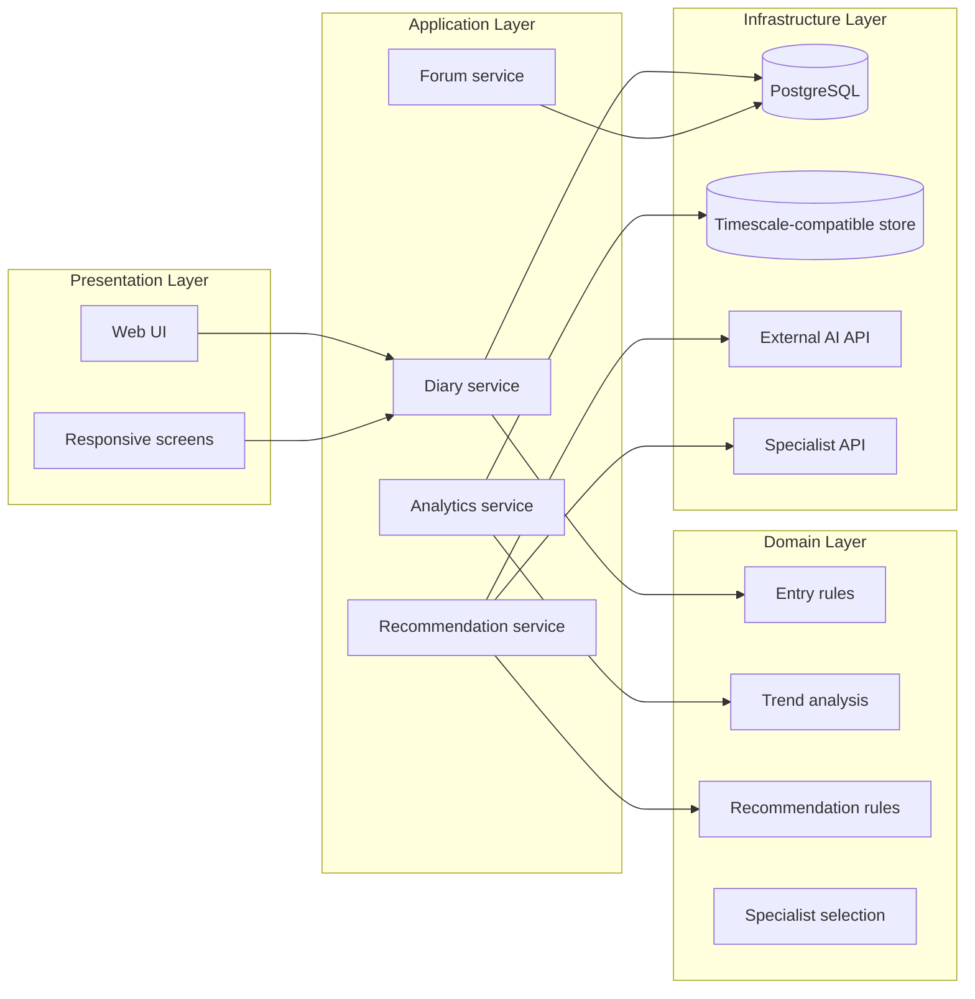

## 23. Специфицировать архитектуру

23.1. Архитектура системы опирается на модульный разрез по подсистемам и на четкие интерфейсы между ними.

23.2. Подсистемы: учет дневника, аналитика, рекомендации, специалисты, форум, блог.

23.3. Между подсистемами вводятся интерфейсы: IEntryRepository, IAnalysisService, IRecommendationProvider, ISpecialistGateway, INotificationGateway.

23.4. В фазе 2 фиксируется не окончательная физическая реализация, а проектный каркас, который будет расширен в фазе 3.

## 24. Специфицировать класс

24.1. Ключевой класс доменной модели: Entry.

24.2. Класс Entry содержит дату, настроение, события, эмоции и признак синхронизации.

24.3. Класс Analysis содержит агрегированную метрику, текстовый вывод и уровень риска.

### Диаграмма 5. Классы проектирования

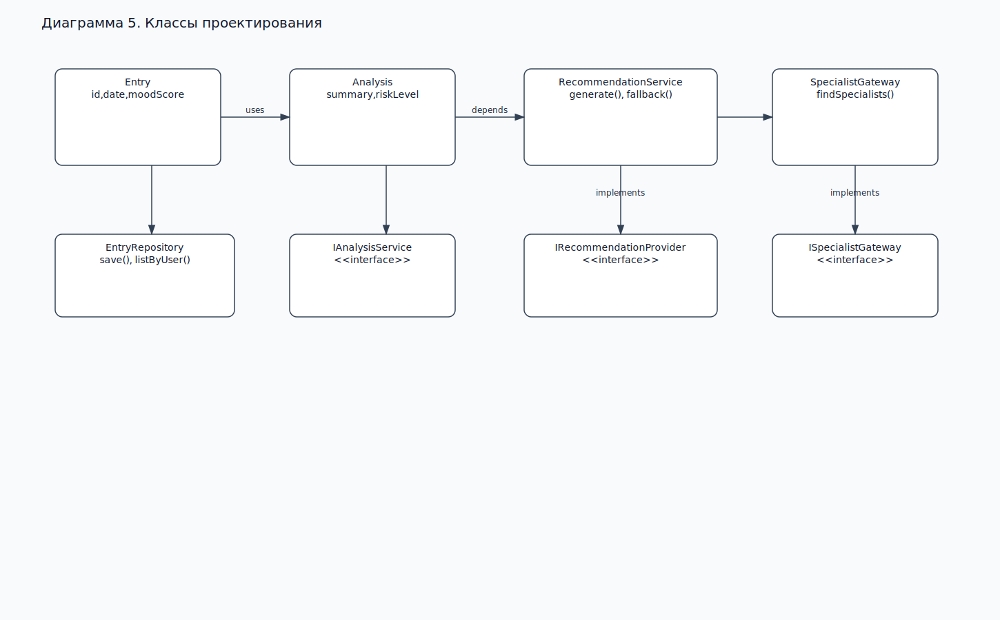

Mermaid source

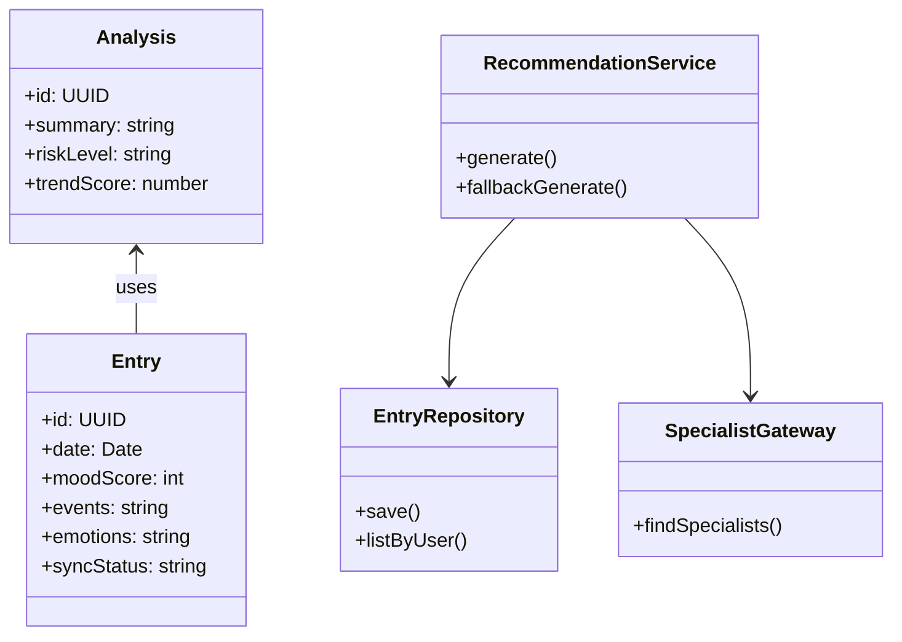

## 25. Специфицировать интерфейсы подсистемы

25.1. Интерфейс IAnalysisService отвечает за построение аналитики на основании списка записей.

25.2. Интерфейс IRecommendationProvider отвечает за генерацию советов и обработку fallback-сценария.

25.3. Интерфейс ISpecialistGateway отвечает за получение списка специалистов из внешнего сервиса.

25.4. Интерфейсы отделяют прикладной слой от инфраструктурных реализаций и позволяют менять внешние сервисы без пересборки доменной логики.

## 26. Спроектировать статическую структуру системы

26.1. Для phase 2 вводится пакетная структура: ui, application, domain, infrastructure, shared.

26.2. Статическая структура должна показывать, где располагаются сущности, сервисы и адаптеры.

26.3. Подсистемы не обращаются к UI напрямую; взаимодействие идет через application layer.

26.4. Для избранных ВИ используется минимальная связка классов, достаточная для демонстрации работоспособности.

## 27. Спроектировать динамическое поведение системы

27.1. Динамика системы фиксируется для сценариев: ввод записи, получение аналитики, генерация рекомендаций, подбор специалиста.

27.2. Для GUI-переходов используются понятные состояния экранов: пустой дневник, форма ввода, отправка, отчет, совет, критический режим.

### Диаграмма 6. Последовательность сценария «Добавить запись и получить анализ»

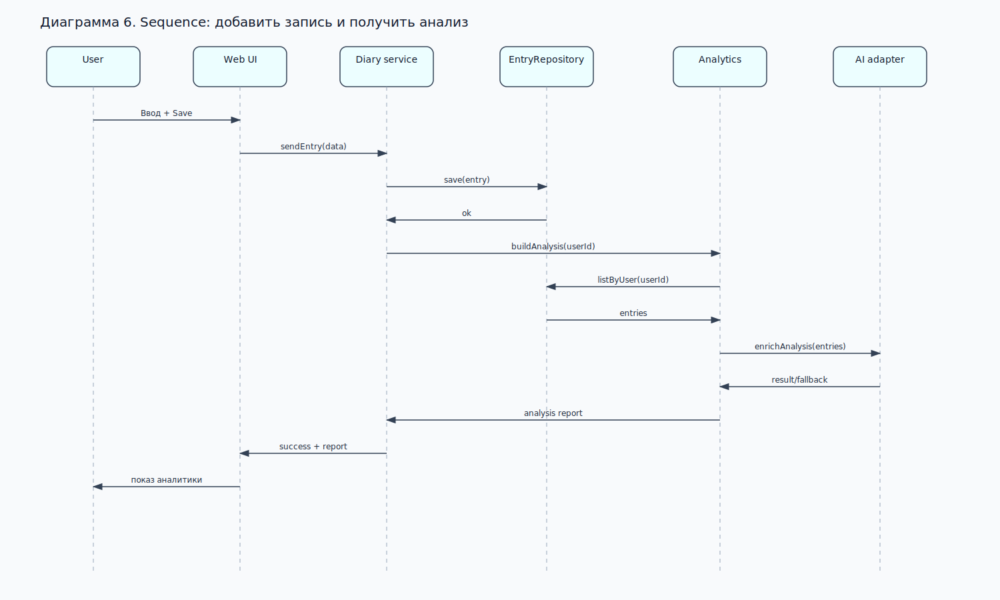

Mermaid source

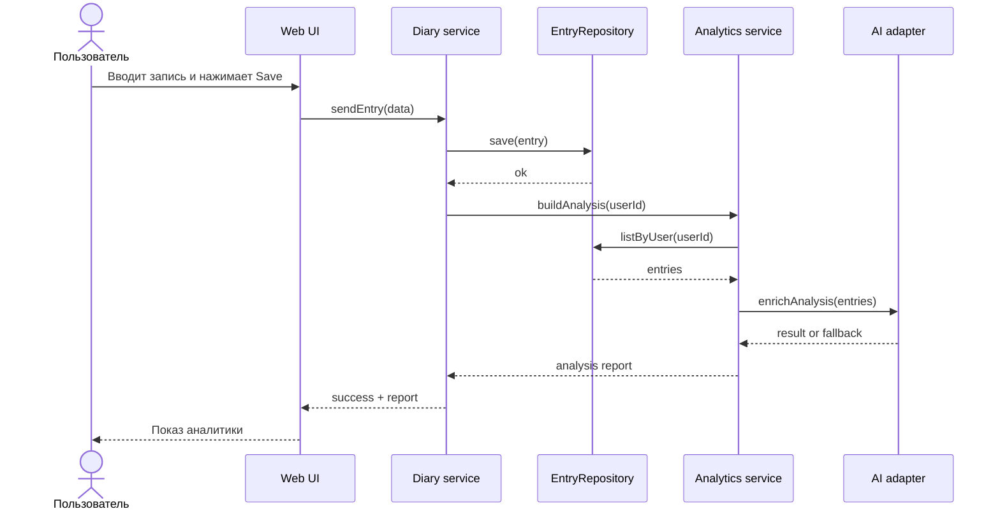

### Диаграмма 7. Activity для рекомендаций

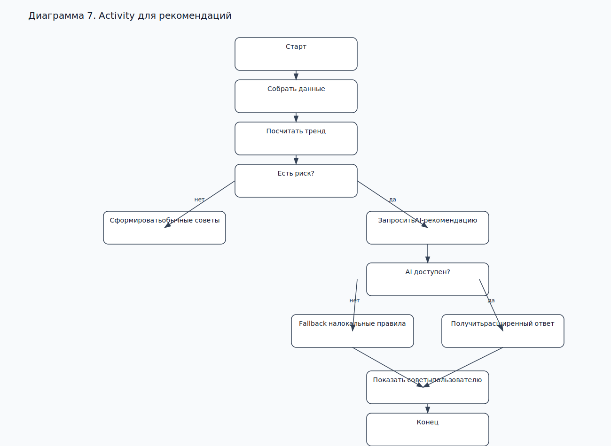

Mermaid source

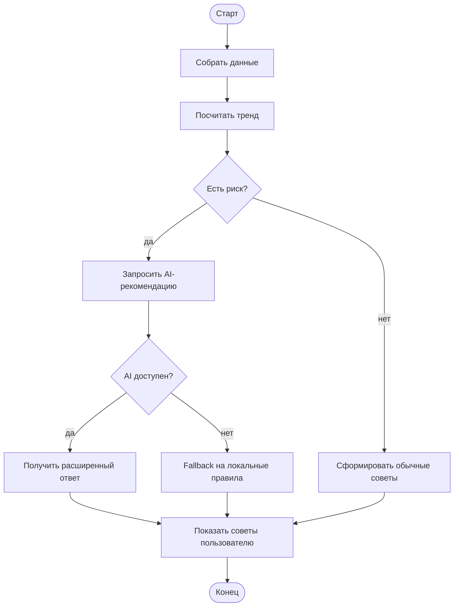

## 28. Разрабатывать прототипы GUI

28.1. Для фазы 2 подготавливаются макеты экранов: главная, дневник, аналитика, рекомендации, специалисты, форум, блог.

28.2. Основной принцип UX: минимум кликов для ежедневной записи.

28.3. Макеты должны показать не только внешний вид, но и логику переходов между экранами.

28.4. Для фазы 3 эти макеты станут основой для реализации интерфейса.

## 29. Сформировать последовательность сборок

29.1. Build 1: каркас приложения, навигация, форма дневника, моковые данные.

29.2. Build 2: сохранение записи, базовая аналитика, графики, черновой AI-адаптер.

29.3. Build 3: рекомендации, подбор специалистов, тесты, интеграция экранов.

29.4. Build 4: единый демонстрационный билд перед фазой 3.

## 30. Выполнить сборку

30.1. Сборка фазы 2 должна быть исполняемой и демонстрировать ключевые пользовательские сценарии.

30.2. Итоговая сборка должна включать UI, backend, базу данных и обработку внешних сервисов в объеме, достаточном для проверки архитектуры.

## 31. Выполнить прямое проектирование класса

31.1. Прямое проектирование класса выполняется для Entry, Analysis, RecommendationService и AI-adapter.

31.2. На этом шаге уточняются атрибуты, методы, зависимости и точки интеграции с внешними сервисами.

## 32. Реализовать подсистему

32.1. Реализация подсистемы в фазе 2 ограничивается ядром, достаточным для проверки архитектурных решений.

32.2. Второстепенные модули, такие как форум и блог, допускается реализовать только на уровне заглушек или прототипа.

## 33. Выполнить тесты на уровне разработчика

33.1. Базовые тесты проверяют корректность сохранения записей, построения аналитики и fallback-ветки рекомендаций.

33.2. Для dev-level тестов достаточно unit и component checks, привязанных к ключевым правилам предметной области.

33.3. Отдельно проверяется корректность работы интерфейса при пустых данных и при ошибках внешних сервисов.

## 34. Определить порядок тестирования системы

34.1. Сначала проверяются отдельные модули, затем интеграционные сценарии, затем весь пользовательский путь.

34.2. Порядок тестирования должен обеспечивать воспроизводимость и постепенное наращивание доверия к билду.

## 35. Определить сценарий тестирования

35.1. Сценарий тестирования: создание записи, построение отчета, получение рекомендаций, переход к подбору специалиста.

35.2. Сценарий строится вокруг ВИ1–ВИ4 и проверяет, что основные архитектурные решения работают совместно.

## 36. Определить процедуру тестирования test-case

36.1. Процедура тестирования: подготовить данные, запустить билд, выполнить входной сценарий, сверить ожидаемый и фактический результат, зафиксировать дефекты.

36.2. Test-case должен иметь идентификатор, предусловия, шаги, ожидаемый результат и критерий прохождения.

## 37. Протестировать реализацию test-case в текущей сборке (текущем билде) системы

37.1. Текущая сборка прогоняется по утвержденному test-case на сценариях ВИ1–ВИ4.

37.2. Проверка выполняется на текущем билде, чтобы зафиксировать реальные расхождения между проектным описанием и реализованным поведением.

## 38. Проверить соответствие требований к системе и test-case

38.1. Результаты тестов сверяются с требованиями к системе, чтобы выявить расхождения и подтвердить полноту покрытия.

38.2. Проверка соответствия показывает, что именно нужно изменить в test-case или в проектных артефактах.

## 39. Внести изменения в test-case

39.1. Если test-case требует уточнения, он изменяется и повторно применяется к текущему билду.

39.2. Изменения в test-case фиксируются отдельно, чтобы следующий прогон был сопоставим с предыдущим.

## 40. Протестировать всю систему согласно test-case

40.1. После корректировки test-case система проверяется целиком по всем шагам сценария.

40.2. Этот шаг подтверждает, что все ключевые части решения работают как единая система.

## 41. Оценить исполняемый эволюционный прототип

41.1. Исполняемый прототип фазы 2 должен запускаться и демонстрировать основной рабочий цикл системы.

41.2. Эволюционный характер прототипа выражается в последовательности билдов и постепенном расширении реализованного ядра.

41.3. Оценка прототипа опирается на результат тестов, стабильность сценариев и готовность архитектуры к фазе 3.

## 42. Сформировать описание архитектуры

42.1. Описание архитектуры включает представления вариантов использования, анализа, проектирования, развертывания и реализации.

42.2. Представление вариантов использования фиксирует ВИ1–ВИ4 как архитектурно значимое ядро системы.

42.3. Представление анализа показывает основные классы предметной области и их связи.

42.4. Представление проектирования показывает подсистемы, интерфейсы и классы реализации.

42.5. Представление развертывания фиксирует размещение клиента, веб-приложения, API, базы данных и внешних сервисов.

42.6. Представление реализации связывает классы и подсистемы с выбранным стеком технологий.

### Диаграмма 8. Развертывание системы

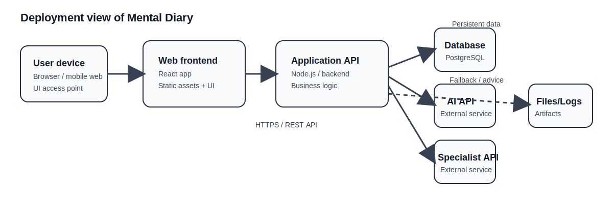

Mermaid source

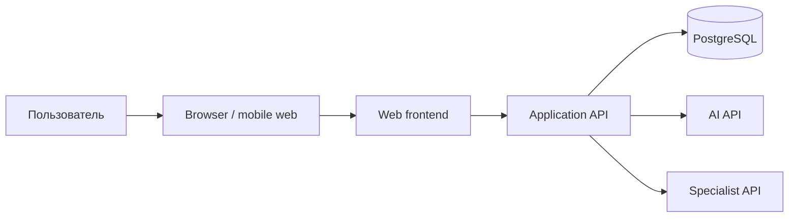

## 43. Сформировать итоговую концепцию фазы 2

43.1. Mental Diary на фазе 2 закрепляется как веб-система мониторинга эмоционального состояния с аналитикой, рекомендациями и подбором специалистов.

43.2. Итог фазы 2 — согласованная архитектура, набор проектных артефактов и тестовая база для перехода к фазе 3.

## 44. Подвести итоги для итераций фазы

44.1. Фаза 2 завершилась переходом от требований к архитектуре, проектированию и проверяемому прототипу.

44.2. Подтверждены приоритеты вариантов использования, зафиксированы подсистемы, интерфейсы, риски и способы реализации.

44.3. Подготовлена база для фазы 3, в которой проект будет реализовываться по утвержденной архитектуре.
